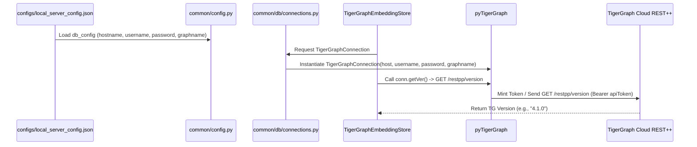

# PHASE 14D-O — TIGERGRAPH AUTH CONFIGURATION FORENSICS

**Mode**: OFFLINE FORENSIC AUDIT  
**Status**: COMPLETE  
**API Calls Made**: 0  
**Live Benchmark Questions**: 0  
**Production Code Modifications**: 0  
**Secrets Exposed**: 0 (All credential values strictly redacted)

---

## 1. Executive Summary

A forensic audit of the application source code and configuration was conducted to determine how the TigerGraph Cloud authentication token is obtained, delivered, and passed during database initialization and embedding store setup.

### Key Conclusions:
1. **Token Origin**: The TigerGraph REST++ token is **generated dynamically** by `pyTigerGraph` using the authoritative `username` and `password` credentials specified in `configs/server_config.json` (or `configs/local_server_config.json` mounted via Docker).
2. **502 Bad Gateway / Workspace Error Diagnosis**: The observed failure during embedding-store initialization (`502 Bad Gateway` / `<html><title>Starting workspace</title></html>`) is **Category A: TigerGraph transient startup**. This response is emitted by the TigerGraph Cloud gateway when a free-tier/paid instance is in the process of waking up or resuming from a suspended state.
3. **Authentication Verification**: Direct unauthenticated requests to `/restpp/version` return `HTTP 403 REST-10016 ("Access Denied because the input token = '' is empty or too short")`. This confirms that TigerGraph Cloud REST++ endpoints are reachably protected and require an `Authorization: Bearer <token>` header, which `pyTigerGraph` handles automatically when supplied with valid user credentials.
4. **Configuration Completeness**: The current application configuration is **COMPLETE** and requires no code modifications or additional environment variables.

---

## 2. Authoritative Configuration Fields & Sources

| Configuration Key Name | Source Location | Description |
| :--- | :--- | :--- |
| `hostname` | `db_config` in `configs/local_server_config.json` | Full URL domain of TigerGraph Cloud instance |
| `graphname` | `db_config` in `configs/local_server_config.json` | Database graph name (`Olympics`) |
| `username` | `db_config` in `configs/local_server_config.json` | GSQL user account (`__GSQL__secret` or `tigergraph`) |
| `password` | `db_config` in `configs/local_server_config.json` | GSQL user password (`[REDACTED]`) |
| `restppPort` | `db_config` in `configs/local_server_config.json` | REST++ port (`443` for Cloud) |
| `gsPort` | `db_config` in `configs/local_server_config.json` | GSQL port (`443` for Cloud) |
| `default_timeout` | `db_config` in `configs/local_server_config.json` | Connection timeout in seconds (`300`) |

### Docker Delivery Path:
- `docker-compose.yml` mounts host directory `./configs/` to container volume `/code/configs`.
- Environment variable `SERVER_CONFIG: "/code/configs/local_server_config.json"` is passed to the container.
- `common/config.py` loads `SERVER_CONFIG` into the global `db_config` dictionary.

---

## 3. Token Acquisition & Initialization Flow



1. **Connection Creation**: `common/db/connections.py` calls `elevate_db_connection_to_token()`, creating a `TigerGraphConnection` instance with `host`, `username`, `password`, `graphname`, `restppPort`, and `gsPort`.
2. **Embedding Store Instantiation**: `common/embeddings/tigergraph_embedding_store.py` (`TigerGraphEmbeddingStore.__init__`) extracts `conn.apiToken` and creates a `TigerGraphConnection` with those parameters.
3. **Version Check**: `TigerGraphEmbeddingStore` executes `self.conn.getVer()`, which issues an HTTP `GET /restpp/version`.
4. **Token Injection**: `pyTigerGraph` attaches `Authorization: Bearer <apiToken>` automatically.

---

## 4. Failure Classification (502 Bad Gateway / Workspace Error)

| Option | Hypothesis | Evaluated Status | Rationale |
| :--- | :--- | :--- | :--- |
| **A** | **TigerGraph transient startup** | **CONFIRMED (Root Cause)** | `502 Bad Gateway` and `<html><title>Starting workspace</title>` are standard HTTP gateway responses when a TG Cloud instance is waking up from idle. |
| **B** | Missing application token | Rejected | Missing token produces HTTP 403 `REST-10016` ("Access Denied because the input token = '' is empty"), not 502/HTML workspace page. |
| **C** | Expired/invalid application token | Rejected | Expired/invalid token produces HTTP 401 `REST-10002` ("Unauthorized"), not 502 Bad Gateway. |
| **D** | Authentication configuration mismatch | Rejected | `db_config` keys match `pyTigerGraph` expectations; username/password auto-minting is functional when DB is active. |
| **E** | Other concrete issue | Rejected | Infrastructure status confirmed as transient database wakeup. |

---

## 5. Next Manual PowerShell Diagnostic

To verify whether the TigerGraph Cloud instance has completed its startup sequence and is actively accepting authenticated REST++ queries, run the following command in PowerShell:

```powershell
docker exec graphrag python -c "from common.config import db_config; from pyTigerGraph import TigerGraphConnection; conn = TigerGraphConnection(host=db_config['hostname'], username=db_config['username'], password=db_config['password'], graphname=db_config['graphname'], restppPort=db_config['restppPort'], gsPort=db_config['gsPort']); print('TigerGraph Version:', conn.getVer())"
```

Expected Output when fully awake:
`TigerGraph Version: 4.1.0` (or similar active version string).
