# System Metrics Dashboard

> **Authoritative Benchmark Source:** [`docs/THREE_WAY_METRICS_RECONCILIATION.md`](file:///d:/Hackathons/TigerGraph/docs/THREE_WAY_METRICS_RECONCILIATION.md)  
> **Dataset:** `data/eval_public.jsonl` (100 Questions) | **SHA-256:** `ABDDB7D18A6D8ED908F514A7E560FE4950EBE479EBB2CDB75A7456887C10C6E5`

---

## 1. Executive Metrics

### Paradigm Evolution
$$\text{Classical RAG} \longrightarrow \text{GraphRAG} \longrightarrow \text{Agentic GraphRAG}$$

### Accuracy Progression
$$\mathbf{19\%} \longrightarrow \mathbf{20\%} \longrightarrow \mathbf{95\%}$$

> [!IMPORTANT]
> - **Overall Normalized Accuracy:** **95.0%** (95 / 100 Questions)
> - **HTTP Success Rate:** **100.0%** (100 / 100 Requests Completed)
> - **Gold Evidence Recall:** **95.0%** (95 / 100 Questions)

---

## 2. Primary Comparison Table

| Metric | Classical RAG | GraphRAG | Agentic GraphRAG |
|---|---:|---:|---:|
| **Questions** | 100 | 100 | **100** |
| **Normalized Accuracy** | 19.0% | 20.0% | **95.0%** |
| **HTTP Success Rate** | 100% | 100% | **100%** |
| **Gold Evidence Recall** | 3.0% | 16.0% | **95.0%** |
| **Total Runtime** | 1128.9s | 3504.3s | **3943.0s** (~65.7 min) |
| **Avg Latency per Question** | 11.29s | 35.04s | **39.43s** |
| **Avg Tokens per Question** | 8617.17 | 1103.30 | **7718.01** |
| **LLM Calls per Question** | 1.00 | 1.00 | **3.04** |

---

## 3. Accuracy Visualization

```mermaid
gantt
    title Accuracy Comparison (% Correct out of 100 Public Questions)
    dateFormat X
    axisFormat %s%%
    section Classical RAG
    19% Accuracy : 0, 19
    section GraphRAG
    20% Accuracy : 0, 20
    section Agentic GraphRAG
    95% Accuracy : 0, 95
```



### Measured Normalized Accuracy Comparison
- **Classical RAG:** `19%`  █████▍
- **GraphRAG:** `20%`  ██████
- **Agentic GraphRAG:** `95%`  █████████████████████████████

---

## 4. Gold Evidence Recall

```mermaid
gantt
    title Gold Evidence Recall (% Evidence Retrieved)
    dateFormat X
    axisFormat %s%%
    section Classical RAG
    3% Recall : 0, 3
    section GraphRAG
    16% Recall : 0, 16
    section Agentic GraphRAG
    95% Recall : 0, 95
```



### Why Gold Evidence Recall Matters
Evidence Recall measures whether the retrieval subsystem actually retrieved the ground-truth facts required to answer the question. 
- **Classical RAG (3.0% Recall):** Fails on multi-hop questions because top-k vector search retrieves distractor chunks containing shared venue/year keywords rather than specific event records.
- **GraphRAG (16.0% Recall):** Suffered 73 zero-context dropouts (73% failure rate) when seed vector nodes lacked outgoing `DOCUMENT_HAS_EVENT` edges in the graph schema for 1-hop expansion.
- **Agentic GraphRAG (95.0% Recall):** Achieves near-perfect evidence recall by dynamically routing queries to deterministic TigerGraph GSQL tools (`lookup`, `aggregate`, `superlative`, `temporal_resolve`) with hybrid vector fallback.

---

## 5. Latency & Cost Trade-Off Analysis

| Metric | Classical RAG | GraphRAG | Agentic GraphRAG |
|---|---:|---:|---:|
| **Total Benchmark Runtime** | 1,128.9s | 3,504.3s | **3,943.0s** |
| **Mean Latency per Question** | 11.29s | 35.04s | **39.43s** |
| **Median Latency per Question** | 3.97s | 28.03s | **25.22s** |
| **Cost per Benchmark Run** | $0.00 | $0.00 | **$0.00** |

> [!NOTE]
> **Latency Rationale:** Agentic GraphRAG exhibits higher measured latency (39.43s mean) than simpler single-pass systems because each question undergoes structured planning, schema resolution, deterministic GSQL tool execution, hybrid retrieval fallback when needed, and final synthesis.
> 
> **Cost Rationale:** Cost is recorded as $0.00 across all paradigms under the benchmark configuration because evaluations were conducted using local open-weights embedding models (Qwen-3 0.6B) and open API endpoints (AIRouter).

---

## 6. Agentic GraphRAG Performance Breakdown

### Accuracy by Question Category

| Question Category | Total Questions | Correct | Accuracy (%) | Mean Latency (s) |
|---|---:|---:|---:|---:|
| **Aggregation** | 21 | 21 | **100.0%** | 26.51s |
| **Lookup** | 19 | 19 | **100.0%** | 44.94s |
| **Temporal** | 22 | 22 | **100.0%** | 43.52s |
| **Superlative** | 10 | 10 | **100.0%** | 22.46s |
| **Multi-Hop** | 28 | 23 | **82.1%** | 48.22s |
| **Total** | **100** | **95** | **95.0%** | **39.43s** |

### Question Complexity Split

```
Non-Multi-Hop Questions (72/72):  100.0%  ██████████████████████████████
Multi-Hop Questions (23/28):       82.1%  ███████████████████████▍
```

---

## 7. Measured Improvement Over Baselines

### Accuracy Gain vs Baselines
- **Agentic vs Classical RAG:** `95.0% - 19.0%` = **+76.0 percentage points** (**5.0x improvement**)
- **Agentic vs GraphRAG:** `95.0% - 20.0%` = **+75.0 percentage points** (**4.75x improvement**)
- **Phase-15 Multi-Hop Optimization Gain:** `88.0% → 95.0%` = **+7.0 percentage points** (**+37.5% relative error reduction**)

---

## 8. Technical Architecture Progression

```
[ Classical RAG ]
   └─► Question ──► Vector Similarity Search ──► LLM Synthesis ──► Answer (19% Acc)

[ GraphRAG ]
   └─► Question ──► Vector Seed ──► 1-Hop Graph Expansion ──► LLM Synthesis ──► Answer (20% Acc)

[ Agentic GraphRAG ]
   └─► Question ──► Planner/Triage ──► Deterministic GSQL Tools / Hybrid Search ──► Synthesis ──► Answer (95% Acc)
```

1. **Classical RAG:** Single-turn vector similarity search against embedded text chunks followed by LLM prompt synthesis.
2. **GraphRAG:** Vector seed search followed by fixed 1-hop graph relationship expansion before LLM synthesis.
3. **Agentic GraphRAG:** Question triage and multi-step plan generation, routing to deterministic TigerGraph GSQL graph algorithms (`lookup`, `aggregate`, `superlative`, `temporal_resolve`) with hybrid vector search fallback, followed by schema-constrained answer synthesis.

---

## 9. Important Benchmark Caveats

1. **Identical Benchmark Dataset:** All three systems were evaluated against the exact same 100-question public evaluation dataset (`data/eval_public.jsonl`, SHA-256 `ABDDB7D18A6D8ED908F514A7E560FE4950EBE479EBB2CDB75A7456887C10C6E5`).
2. **Official Evaluation Metric:** Normalized Accuracy (via [`benchmark/unified_evaluator.py`](file:///d:/Hackathons/TigerGraph/benchmark/unified_evaluator.py)) is the authoritative metric.
3. **Historical Pilot Supersession:** Historical pilot subset estimates (e.g., 43% or 64% on 15-question samples) and unnormalized strict-match 0% figures are superseded by the complete 100Q normalized evaluation.
4. **Final Production State:** The Agentic GraphRAG results reflect the final Phase 15 production system.
5. **Execution Latency:** Measured latencies depend on container host hardware and API endpoint responsiveness.
6. **Zero Cost Definition:** Cost reflects the recorded benchmark execution configuration utilizing open-weights models and free-tier endpoints.

---

## 10. Submission Summary Card

```markdown
==========================================================================
                     TIGERGRAPH AGENTIC GRAPHRAG
                   BENCHMARK SUBMISSION SUMMARY CARD
==========================================================================
Dataset:                 100 Public Questions (data/eval_public.jsonl)
Dataset SHA-256:         ABDDB7D18A6D8ED908F514A7E560FE4950EBE479EBB2CDB75A7456887C10C6E5
--------------------------------------------------------------------------
Classical RAG Accuracy:  19.0%  (19 / 100)
GraphRAG Accuracy:       20.0%  (20 / 100)
Agentic GraphRAG Acc:    95.0%  (95 / 100)  [5.0x over RAG, 4.75x over GraphRAG]
--------------------------------------------------------------------------
Gold Evidence Recall:    95.0%  (95 / 100)
HTTP Success Rate:       100.0% (100 / 100)
Non-Multi-Hop Accuracy:  100.0% (72 / 72)
Multi-Hop Accuracy:      82.1%  (23 / 28)
--------------------------------------------------------------------------
Total Runtime:           3,943.0s (~65.7 minutes)
Mean Latency:            39.43s / question
LLM Calls:               3.04 calls / question
Primary Model:           openai/gpt-oss-20b via AIRouter + TigerGraph MCP
==========================================================================
```
