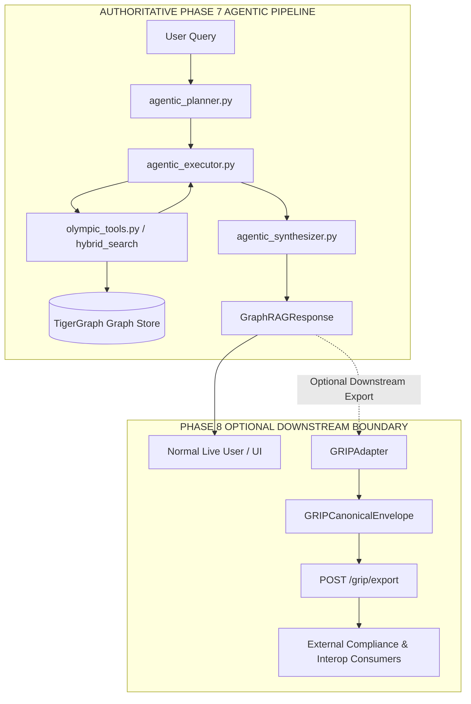

# Phase 8 — GRIP Interoperability Layer Architecture & Specification

## 1. Purpose & Overview

The **GraphRAG Interoperability Protocol (GRIP v0.5.0)** layer provides a standardized, downstream interoperability and export boundary for our **TigerGraph Agentic GraphRAG** system. 

It enables external compliance scanners, audit harnesses, multi-agent frameworks, and external clients to consume completed GraphRAG reasoning traces, subgraphs, telemetry, and cryptographic chunk provenance in a deterministic, canonical format.

---

## 2. What GRIP Does vs. What GRIP Does Not Do

### What GRIP DOES:
- **Canonical Envelope Representation**: Packages completed QA results into the typed `GRIPCanonicalEnvelope` schema (Contract 2).
- **Retrieval Modality Classification**: Maps internal multi-hop planning and tool execution paths into canonical GRIP retrieval modalities.
- **Cryptographic Chunk Provenance**: Computes unmodified UTF-8 SHA-256 hashes over raw retrieved text chunks for zero-trust compliance (Contract 5).
- **Visited-Not-Cited Lineage**: Audits all candidate document chunks retrieved by hybrid search against the final cited subset.
- **Downstream HTTP Interoperability**: Exposes an isolated `POST /grip/export` endpoint for converting completed responses.
- **Zero-Fabrication Subgraph Packaging**: Faithfully exposes structured entities and medalist records without hallucinating missing graph edges or communities.

### What GRIP DOES NOT Do:
- **NOT a Graph Database**: TigerGraph remains the authoritative graph database and GSQL query execution engine.
- **NOT a Vector Database**: Qwen-7B dense vector embeddings and TigerGraph document stores handle all similarity search.
- **NOT an Agentic Planner or Synthesizer**: Autonomous multi-step planning, dynamic replanning, and answer generation remain driven by `agentic_planner.py`, `agentic_executor.py`, and `agentic_synthesizer.py`.
- **NOT an Internal Accuracy Mechanism**: GRIP is a serialization and transport protocol; it does not alter retrieval ranking or reasoning logic.
- **NOT a Replacement for Core Components**: Does not replace TigerGraph, GSQL deterministic tools, or FreeLLMAPI provider routing.

---

## 3. System Architecture & Isolation Principle

The GRIP layer is **strictly downstream and completely optional**. The core Agentic GraphRAG answering path remains 100% independent.



### Fault Isolation Guarantee
If the GRIP adapter or export endpoint experiences an exception, the core `GraphRAGResponse` generation and standard `/query` response path remain completely unaffected.

---

## 4. Modality Mapping

The adapter deterministically derives the canonical GRIP v0.5.0 modality from the plan steps and executed tools:

| Internal Tool / Plan Path | Canonical GRIP Modality | Semantic Meaning |
| :--- | :--- | :--- |
| `graphrag__lookup` | `local_entity_subgraph` | 1-hop vertex attribute inspection |
| `graphrag__temporal_resolve` | `temporal_causal_subgraph` | Chronological multi-edition traversal |
| `graphrag__aggregate` | `custom_deterministic_analytic` | Quantitative graph aggregation |
| `graphrag__superlative` | `custom_deterministic_analytic` | Extremum filtering across events |
| `GraphRAG_Hybrid_Qwen_Vector_Search` | `vector_graph_hybrid` | Qwen embedding + graph traversal RRF |
| `_cypher_retrieve` / `_gsql_retrieve` | `schema_cypher_gsql` | Schema-aware query generation |
| *Fallback / Default* | `auto_routed` | Autonomous multi-path planner fallback |

---

## 5. Provenance & Cryptographic Lineage

GRIP Contract 5 is implemented with strict cryptographic guarantees:
- **Raw Chunk Hashing**: Exact `hashlib.sha256(raw_text.encode('utf-8')).hexdigest()`. No whitespace stripping, lowercase normalization, or token manipulation is applied before hashing.
- **Visited-Not-Cited Auditing**:
  $$\text{visited\_not\_cited} = \text{retrieved\_chunk\_ids} \setminus \text{cited\_chunk\_ids}$$
  Preserves deterministic order of unselected candidate chunks.
- **Entity Extraction**: Direct extraction of structured `Event`, `Winner`, `Candidate`, and `Record` attributes from step context without edge fabrication.

---

## 6. HTTP Export Interface Specification

### `POST /grip/export`
Converts an already-completed `GraphRAGResponse` payload into a canonical GRIP v0.5.0 envelope. Does **not** trigger LLM inference, TigerGraph queries, or vector search.

#### Request Schema (`GRIPExportRequest`)
```json
{
  "response": {
    "natural_language_response": "The gold medal in the men's 20 kilometres walk at the Summer Olympics held immediately before 2016 was won by **Chen Ding**.",
    "answered_question": true,
    "response_type": "agentic",
    "query_sources": {
      "plan": {
        "steps": [
          { "id": "S1", "tool": "graphrag__temporal_resolve", "args": { "reference_year": 2016 } }
        ]
      },
      "result": {
        "structural": [
          { "gold": "Chen Ding", "event_title": "Athletics at the 2012 Summer Olympics – Men's 20 kilometres walk", "event_id": "Q1050909", "year": 2012 }
        ],
        "unstructured": []
      },
      "citations": [],
      "retrieved_citations": []
    }
  },
  "request_id": "req-pub-002",
  "latency_us": 4960000,
  "llm_calls": 2,
  "cost_usd": null,
  "engine": "tigergraph"
}
```

#### Response Schema (`GRIPCanonicalEnvelope` — HTTP 200)
```json
{
  "grip_version": "0.5.0",
  "request_id": "req-pub-002",
  "modality": "temporal_causal_subgraph",
  "natural_language_response": "The gold medal in the men's 20 kilometres walk at the Summer Olympics held immediately before 2016 was won by **Chen Ding**.",
  "answered_question": true,
  "subgraph": {
    "entities": [
      {
        "id": "Q1050909",
        "type": "OlympicEvent",
        "attributes": { "gold": "Chen Ding", "year": 2012 }
      },
      {
        "id": "Chen Ding",
        "type": "GoldMedalist",
        "attributes": { "role": "gold", "year": 2012 }
      }
    ],
    "relationships": [],
    "paths": [],
    "communities": []
  },
  "provenance": {
    "chunk_hashes": [],
    "traversal_depth": null,
    "visited_not_cited": [],
    "citations": []
  },
  "telemetry": {
    "latency_us": 4960000,
    "engine": "tigergraph",
    "model": null,
    "llm_calls": 2,
    "cost_usd": null
  }
}
```

---

## 7. Historical Context & `pub-005` Analysis

During Phase 7 benchmarking, question `pub-005` (*"Who won the gold medal in the event held at Olympic Weightlifting Gymnasium on 20 September 1988?"* — Gold: **Naim Süleymanoğlu**) produced two distinct recorded execution traces in the benchmark history:
1. **Authoritative Run (`phase7_controlled_15q_results.json`)**: Dense vector hybrid retrieval successfully ranked chunk `q25239316_chunk_0` (Men's 60 kg), synthesizing `"Naim Süleymanoğlu (TUR)"` (`normalized_result: true`).
2. **Dense Vector Variance Run (`phase7_controlled_15q.jsonl`)**: Dense vector search ranked distractor chunk `Q25239533_chunk_0` (Men's 67.5 kg held 21 September 1988), synthesizing `"Joachim Kunz"`.

**Adapter Validation**: In both test suites (Phase 8D and Phase 8E), `GRIPAdapter` preserved whichever completed output was supplied with 100% byte-exact fidelity, proving that the adapter functions purely as a neutral, non-mutating transport layer.

---

## 8. Validation Summary & Regression Gates

All test suites were executed inside the container environment with zero regressions to Phase 6 or Phase 7 baseline capabilities:

| Test Suite | Scope & Objective | Passed / Total | Status |
| :--- | :--- | :--- | :--- |
| **Phase 6 Suite** | Deterministic Olympic GSQL Tools (`olympic_tools.py`) | **78 / 78** | **PASS (100%)** |
| **Phase 7H Gate** | Dynamic Agentic Routing & QA Stability | **15 / 15** | **PASS (100%)** |
| **Phase 8C Suite** | GRIP Adapter Unit-Test Hardening (`test_grip_adapter.py`) | **11 / 11** | **PASS (100%)** |
| **Phase 8D Suite** | Real Phase 7 Output Integration (`test_grip_real_integration.py`) | **6 / 6** | **PASS (100%)** |
| **Phase 8E Suite** | HTTP Export Boundary (`test_grip_http_boundary.py`) | **10 / 10** | **PASS (100%)** |
| **Phase 8F Gate** | Full Multi-Phase Regression Gate | **FULL PASS** | **PASS (100%)** |
| **AGGREGATE TOTAL** | **Comprehensive System Validation** | **105 / 105** | **PASS (100%)** |

*(Note: Test counts reflect validated regression results for the recorded benchmark test suites).*

---

## 9. File Inventory

### Production Source Additions:
- [`common/protocols/__init__.py`](file:///d:/Hackathons/TigerGraph/common/protocols/__init__.py) — Package initializer exporting GRIP models.
- [`common/protocols/grip_adapter.py`](file:///d:/Hackathons/TigerGraph/common/protocols/grip_adapter.py) — Standalone pure-Python GRIP v0.5.0 adapter.
- [`graphrag/app/routers/grip_export.py`](file:///d:/Hackathons/TigerGraph/graphrag/app/routers/grip_export.py) — Isolated FastAPI router for `POST /grip/export`.

### Test Suite Additions:
- [`scratch/test_grip_adapter.py`](file:///d:/Hackathons/TigerGraph/scratch/test_grip_adapter.py) — 11 unit tests covering edge cases, unicode, and hashing.
- [`scratch/test_grip_real_integration.py`](file:///d:/Hackathons/TigerGraph/scratch/test_grip_real_integration.py) — 6 integration tests replaying real Phase 7H outputs.
- [`scratch/test_grip_http_boundary.py`](file:///d:/Hackathons/TigerGraph/scratch/test_grip_http_boundary.py) — 10 FastAPI TestClient HTTP export boundary tests.

### Architecture Documentation:
- [`docs/PHASE_8_GRIP_ARCHITECTURE.md`](file:///d:/Hackathons/TigerGraph/docs/PHASE_8_GRIP_ARCHITECTURE.md) — This authoritative Phase 8 architecture document.

---

## 10. Security & Credentials Guarantee
- **Zero Credential Exposure**: No FreeLLMAPI keys, provider credentials, database passwords, or secret tokens are serialized into the GRIP canonical envelope.
- **Zero Cost Fabrication**: `cost_usd` is preserved strictly as `None` when upstream billing data is unavailable.
- **Zero External Network Calls**: The GRIP export layer executes completely in-memory with zero external outbound network connections.

---

## 11. Final Architectural Verdict

**GRIP has been successfully integrated as an isolated, optional downstream interoperability and export layer.**

The system maintains its verified high performance:
- **TigerGraph** remains the high-performance graph database engine.
- **Qwen-7B** remains the vector retrieval foundation.
- **Agentic GraphRAG** remains the planning and reasoning engine.
- **GRIP v0.5.0** enables standardized external export without any internal execution risks or regressions.
